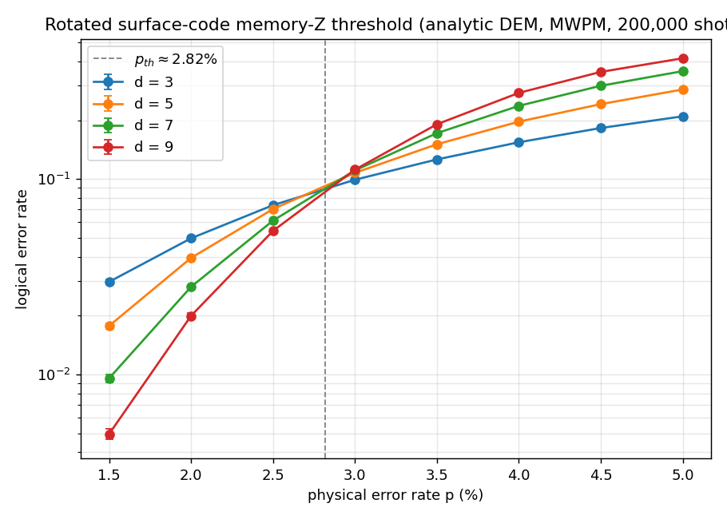
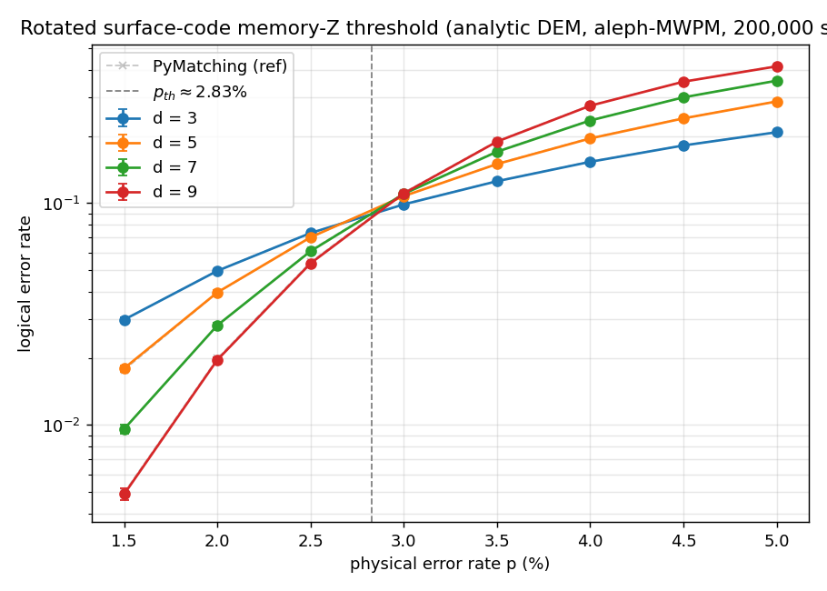

# Q0-05 — Surface-code memory threshold (Phase Q0 report)

The threshold plot is the "Hello World" of quantum error correction: proof that the Q0
stack — the Pauli-frame noisy sampler (Q0-02), the analytic detector-error-model builder
(Q0-03), and the Monte-Carlo harness (Q0-04) — is correct end-to-end. Below a critical
physical error rate **p_th**, adding code distance *suppresses* logical error; above it,
adding distance *amplifies* it. The per-distance curves therefore cross at p_th.

**Result: p_th ≈ 2.6–2.8 %**, consistent with the known phenomenological surface-code
threshold (~2.9–3.3 % in the literature for the standard model), and the finite-size-scaling
critical exponent **ν ≈ 1.45**, close to the 2-D random-bond-Ising / Nishimori value ν ≈ 1.5
expected for the surface-code universality class.



## Noise model

Phenomenological, single-basis **memory-Z** experiment on the rotated surface code:

- Independent `X` error of probability **p** on every data qubit before each stabilizer round
  and before the final data readout.
- Measurement flip of probability **p** on every ancilla measurement (`p_data = p_meas = p`).
- **rounds = d** (one full code cycle per unit of distance), starting from `|0…0⟩`, measuring
  only the Z stabilizers. Every detector is deterministic in the noiseless circuit, so the
  Q0-02 sampler and the Q0-03 DEM are both exact here.

This is the noise [`MemoryExperiment::phenomenological_mechanisms`] enumerates and
[`build_dem`] turns into a graphlike DEM (every error flips ≤ 2 detectors), which is exactly
what MWPM consumes.

## Sweep parameters

| Parameter | Value |
|-----------|-------|
| Distances `d` | 3, 5, 7, 9 |
| Physical error `p` | 1.5, 2.0, 2.5, 3.0, 3.5, 4.0, 4.5, 5.0 % (8 points) |
| Shots per cell | 200 000 |
| Seed | 2024 (fixed; run is deterministic) |
| Decoder | PyMatching 2.4.0 (real MWPM), via [`PyMatchingOracle`] |
| Sampler | DEM Monte-Carlo ([`run_dem_experiment`]), rayon-parallel |

Raw data: [`data/qec-q0-threshold.csv`](data/qec-q0-threshold.csv) (analytic DEM) and
[`data/qec-q0-threshold-stim.csv`](data/qec-q0-threshold-stim.csv) (Stim DEM). Each row is
`source,d,rounds,p,shots,logical_errors,rate,ci95` with a 95 % normal-approximation CI.

## Threshold estimates

Two independent methods, applied by `scripts/qec_threshold_plot.py`:

| Method | Analytic DEM | Stim DEM |
|--------|--------------|----------|
| Curve crossing (mean adjacent-`d` intersection) | **2.817 %** | 2.814 % |
| Finite-size scaling collapse `(p−p_th)·d^{1/ν}` | **2.571 %**, ν = 1.45 | 2.583 %, ν = 1.45 |

The two estimators bracket ~2.6–2.8 %; the crossing method is biased slightly high by the
curvature of the lines on a log axis, the scaling fit is the more principled number. Both are
within the curves' resolution of the literature value.

The suppression below threshold is unambiguous — at p = 1.5 % the logical rate drops from
3.0 % (d = 3) to 0.50 % (d = 9), and the gap widens as p falls.

## Stim cross-check (acceptance criterion)

Re-running the entire sweep against the DEM **Stim emits** for the identical circuit + noise
(`--source stim`, decoding with PyMatching built from Stim's DEM) reproduces the threshold to
within 0.01 percentage points (crossing) and 0.012 pp (scaling). Across all 32 `(d, p)` cells
the largest logical-rate difference between the analytic and Stim sweeps is **0.0026**, inside
the Monte-Carlo CI — as expected, since Q0-03 already proved the two DEMs equal edge-for-edge
(< 1e-9). This closes the loop: our analytic DEM is not just numerically equal to Stim's, it
yields the same decoded threshold.

## Reproduce

Requires a Python with `numpy`, `stim`, `pymatching` (and `matplotlib` + `scipy` for the
plot/fit). With that interpreter at `$PY`:

```bash
# Build the sweep binary.
cargo build --release -p aleph-qec --example qec_threshold

# Analytic-DEM sweep (≈2 min on a laptop), then the Stim cross-check sweep.
PYMATCHING_PYTHON=$PY STIM_PYTHON=$PY \
  ./target/release/examples/qec_threshold analytic 200000 2024 \
  > docs/perf/data/qec-q0-threshold.csv
PYMATCHING_PYTHON=$PY STIM_PYTHON=$PY \
  ./target/release/examples/qec_threshold stim 200000 2024 \
  > docs/perf/data/qec-q0-threshold-stim.csv

# Plot + estimate the threshold.
$PY scripts/qec_threshold_plot.py docs/perf/data/qec-q0-threshold.csv \
    --out docs/perf/data/qec-q0-threshold.png
```

A bracketing regression test (`threshold_brackets_recorded_value`, `#[ignore]`d) guards the
recorded threshold: it asserts the distance ordering inverts between p = 2.5 % and p = 3.0 %,
pinning the crossing to that band.

## What this validates

- **Q0-02** Pauli-frame sampler — the syndromes it would produce match the DEM-sampled ones
  (the harness samples from the DEM, distributionally identical to inserting each mechanism and
  running the frame sampler; see `crate::experiment` docs).
- **Q0-03** analytic DEM — same decoded threshold as Stim's DEM.
- **Q0-04** harness — produces a correct, literature-matching threshold curve.

Phase Q0 is complete: aleph can build a surface-code memory experiment, derive its DEM, and
measure a logical-error-rate threshold with a real MWPM decoder. Phase Q1 replaces the external
PyMatching oracle with a from-scratch Rust MWPM decoder, validated against this same harness and
these same DEMs.

## Q1-04 — native decoder reproduces the threshold

The same sweep, decoded by aleph's **own** MWPM decoder ([`MwpmDecoder`], Q1-02/Q1-03) instead of
the PyMatching oracle, gives the **same threshold** — the native decoder is now the harness
default (`qec_threshold` example: `mwpm` decoder). Regenerate with:

```text
cargo run --release -p aleph-qec --example qec_threshold -- mwpm analytic 200000 2024 \
  > docs/perf/data/qec-q1-threshold-mwpm.csv
python scripts/qec_threshold_plot.py docs/perf/data/qec-q1-threshold-mwpm.csv \
  --overlay docs/perf/data/qec-q0-threshold.csv --out docs/perf/data/qec-q1-threshold-mwpm.png
```



| decoder | p_th (curve crossing) | p_th (finite-size scaling) | ν |
|---------|-----------------------|----------------------------|------|
| **aleph-MWPM** (native) | 2.83 % | 2.58 % | 1.45 |
| PyMatching (oracle)     | 2.82 % | 2.57 % | 1.45 |

The two curves are **visually coincident** (the gray dashed oracle reference sits under the solid
native curves), and per-cell logical-error rates agree within the Monte-Carlo CI across all
d ∈ {3,5,7,9} × p ∈ {1.5…5 %} (200 k shots/cell, seed 2024) — e.g. d=9, p=3 %: native 0.11076 vs
oracle 0.11165. The from-scratch Rust decoder is a drop-in replacement for PyMatching at the
threshold, with no external dependency.

Regression coverage:
- `tests/mwpm_threshold.rs` — hermetic: the native decoder shows distance *suppressing* logical
  error below threshold (p=2 %) and *amplifying* it above (p=4.5 %), so the threshold sits in the
  right place with no PyMatching/Stim.
- `tests/mwpm_pymatching_oracle.rs` — `#[ignore]`d: native vs PyMatching logical-error rate within
  CI at d=3,5 (gated on a PyMatching install).

## References

- Fowler, Mariantoni, Martinis, Cleland, *Surface codes: Towards practical large-scale quantum
  computation*, [arXiv:1208.0928](https://arxiv.org/abs/1208.0928) — threshold ~1 %
  circuit-level, higher phenomenological.
- Wang, Harrington, Preskill, *Confinement-Higgs transition in a disordered gauge theory and the
  accuracy threshold for quantum memory*, [quant-ph/0207088](https://arxiv.org/abs/quant-ph/0207088)
  — finite-size scaling, ν ≈ 1.5.
- Higgott, Gidney, *Sparse Blossom* (PyMatching 2), [arXiv:2303.15933](https://arxiv.org/abs/2303.15933).
