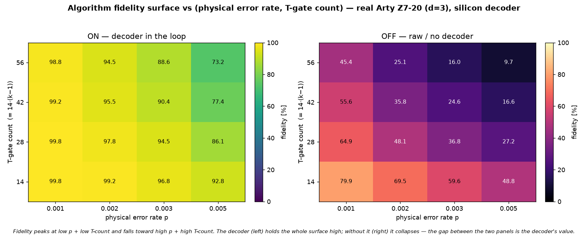

# Q6-31 — 2-D fidelity surface: algorithm fidelity vs (p, T-gate count) on real silicon

Synthesis of Q6-29 (fidelity vs physical error rate) and Q6-30 (fidelity vs T-gate count). Runs the
multi-controlled-X C^kX end-to-end from the silicon decoder over the full grid of (k, p) — control count
k ∈ {2,3,4,5} → T-count {14,28,42,56}, and p ∈ {0.001,0.002,0.003,0.005} — producing a 2-D fidelity
surface. Reuses the Q6-30 emitter + board driver unchanged; only (k, p) vary. No new gadget code.



## Result (real Arty Z7-20, d=3 W=9 C=3, uf_arty_dma_win.bit, 50 MHz, 200 trials/point)

ON — decoder in the loop (truth-table fidelity, %):

| T-count \ p | 0.001 | 0.002 | 0.003 | 0.005 |
|-------------|-------|-------|-------|-------|
| 14 | 99.75 | 99.25 | 96.75 | 92.75 |
| 28 | 99.75 | 97.75 | 94.50 | 86.12 |
| 42 | 99.25 | 95.50 | 90.37 | 77.37 |
| 56 | 98.75 | 94.50 | 88.62 | 73.25 |

OFF — raw / no decoder (%):

| T-count \ p | 0.001 | 0.002 | 0.003 | 0.005 |
|-------------|-------|-------|-------|-------|
| 14 | 79.87 | 69.50 | 59.62 | 48.75 |
| 28 | 64.94 | 48.06 | 36.75 | 27.19 |
| 42 | 55.62 | 35.81 | 24.62 | 16.56 |
| 56 | 45.37 | 25.12 | 16.00 | 9.72  |

The ON surface peaks at low p + low T-count (99.75 %) and falls monotonically along both axes to the
high-p + high-T corner (73.25 %). The OFF surface collapses far faster — from 79.87 % to 9.72 % — so the
gap between the two panels (the decoder's contribution) *grows* toward the demanding corner. Every C^kX
is verified exact off-board (perfect decoder → 100 %), so the only unknown on the board is the decoder.

## The two-axis ASIC argument in one surface

A logical algorithm's fidelity is set by two things the decoder controls: the effective LER (the p axis)
and how many times you pay it (the T-count axis). The surface makes both explicit and shows they
multiply — fidelity ≈ (1 − ε(p))^{N_T}. A decoder ASIC that lowers ε at scale moves the *whole* surface
up, and the payoff is largest exactly where real workloads live: many gates, tight error budget. This
2-D surface is the compact statement of the decoder-quality → algorithm-fidelity dependence the whole
Q6-24…Q6-31 arc built toward.

## Reproduce

```bash
for k in 2 3 4 5; do for p in 0.001 0.002 0.003 0.005; do
  cargo run --release -p aleph-qec --example qec_q6_mcx -- $k 3 9 3 17 200 2024 $p > hw/cosim_mcx_k${k}_p${p}.vec
done; done
scp -i ~/.ssh/arty_pynq hw/sw/uf_qubit_mcx.py hw/sw/tcount_p_surface.sh hw/cosim_mcx_k*_p*.vec xilinx@10.0.1.182:~/
ssh -i ~/.ssh/arty_pynq xilinx@10.0.1.182 'sudo env XILINX_XRT=/usr bash tcount_p_surface.sh' > hw/surface.csv
python3 hw/sw/plot_2d_surface.py hw/surface.csv     # -> docs/perf/qec-q6-2d-surface.png
```

## Next levers

1. **d=7 / KV260** — a lower LER at fixed p lifts the whole surface toward ideal (the distance axis).
2. **A genuine large algorithm** — modular arithmetic, where the T-count is intrinsic (a single point
   deep in the high-T region rather than a swept ladder).
