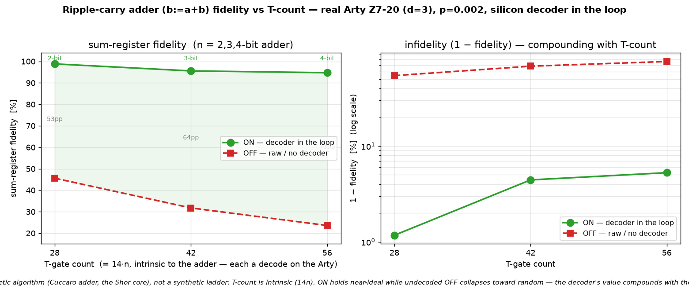

# Q6-32 (Milestone A) — A genuine large algorithm from the decoder: the ripple-carry adder

Follow-up to Q6-30 (T-count scaling) and Q6-31 (the fidelity(p, T-count) surface). Those swept a
**synthetic** knob — the control count of a C^kX — to move along the T-axis. This runs a **real
arithmetic algorithm** whose T-count is *intrinsic*: the Cuccaro ripple-carry adder `b := a + b`
(arXiv:quant-ph/0410184), the addition core of Shor's factoring algorithm, end-to-end from the silicon
decoder on the Arty Z7-20.

An n-bit adder uses n MAJ + n UMA gadgets = **2n Toffolis**; each Toffoli = 7 T/T† gates (Q6-27). So the
circuit is **14n T-gate magic-state injections**, each a code-protected logical measurement DECODED on
the real Arty (Q6-20 sliding-window bitstream, `uf_arty_dma_win.bit`, unchanged). X/CNOT are Clifford (no
decode). Sweeping n = 2,3,4 gives a T-count ladder 28, 42, 56 — the *same counts* as Q6-30's k=3,4,5, but
now carried by a genuine (2n+2)-qubit arithmetic circuit rather than a control-count dial. The verified
output is the deterministic sum register: low n bits of `a+b` in `b`, the carry-out in `z`, `a` restored,
carry-in restored to 0.



## Result (real Arty Z7-20, d=3 W=9 C=3, uf_arty_dma_win.bit, 50 MHz, p=0.002)

| n | qubits (2n+2) | T-gate count | ON (decoder-corrected) | OFF (raw undecoded) | ON−OFF gap |
|---|---------------|--------------|------------------------|---------------------|------------|
| 2 | 6  | 28 | **98.83 %** | 45.61 % | 53 pp |
| 3 | 8  | 42 | 95.57 % | 31.77 % | 64 pp |
| 4 | 10 | 56 | **94.73 %** | 23.60 % | **71 pp** |

Every adder is verified **exact off-board** (perfect decoder → `b := (a+b) mod 2^n`, carry in `z`, `a`
restored, for all 2^{2n} input pairs — the self-check oracle) before it touches the board, so the only
unknown on silicon is the decoder. On the Arty, the decoder holds the sum-register fidelity near-ideal as
the algorithm doubles in T-count (98.8 % → 94.7 %), while the undecoded OFF collapses (45.6 % → 23.6 %)
toward the corrupted baseline. The decoder ran real-time at every size (worst 1.54 µs/window vs the 3 µs
commit budget). As with the synthetic ladder, the infidelity compounds with T-count on both curves but far
faster without the decoder, so the **decoder-value gap widens with algorithm size** (53 → 71 pp) — this
time for a real algorithm.

## Why this matters beyond the synthetic ladder

Q6-30/31 argued the compounding case with a C^kX whose T-count is a free parameter. The obvious rebuttal
is "that's a contrived gadget." The adder answers it: the T-count is *dictated by the arithmetic* (14n for
an n-bit add), not chosen to make a curve. Shor's algorithm is a stack of these adders (modular
exponentiation → modular multiplication → modular addition → ripple-carry addition), so the very same
`(1 − LER)^{N_T}` compounding measured here is exactly what governs a real factoring run — just with N_T in
the millions rather than tens. A decoder that shaves the per-gate LER pays off super-linearly over that
workload. Running the genuine primitive end-to-end from the silicon decoder — not a stand-in — is the point
of this milestone.

## Reproduce

```bash
for n in 2 3 4; do
  cargo run --release -p aleph-qec --example qec_q6_adder -- $n 3 9 3 17 256 2024 0.002 > hw/cosim_adder_n$n.vec
  python3 hw/sw/uf_qubit_adder.py --selfcheck hw/cosim_adder_n$n.vec   # b:=a+b truth table EXACT
done
scp -i ~/.ssh/arty_pynq hw/sw/uf_qubit_adder.py hw/cosim_adder_n*.vec xilinx@10.0.1.182:~/
ssh -i ~/.ssh/arty_pynq xilinx@10.0.1.182 \
  'for n in 2 3 4; do sudo env XILINX_XRT=/usr /usr/local/share/pynq-venv/bin/python3 \
     uf_qubit_adder.py uf_arty_dma_win.bit cosim_adder_n$n.vec --trials 256 | grep RESULT; done'
python3 hw/sw/plot_adder.py    # -> docs/perf/qec-q6-adder.png
```

Honest scope (unchanged from the Q6-25..31 arc): magic states are prepared directly, not distilled;
Cliffords are exact; the wrong-decode rate is the surface-code memory-LER. What is new here is a genuine
multi-qubit **arithmetic** algorithm — the Shor addition core — running end-to-end from the silicon
decoder at an intrinsic large T-count.

## Next levers

1. **Milestone B — modular adder `a+b mod N`** (Beauregard / Vedral-Barenco-Ekert): several adders + a
   conditional subtract of N, a few×(14n) T — genuinely deep in the high-T region, the Shor-relevant
   primitive.
2. **Place it on the Q6-31 surface** — the adder points are labelled samples of a real algorithm on the
   fidelity(p, T-count) map.
3. **d=7 / KV260** — a lower LER at the same p lifts the whole adder curve.
