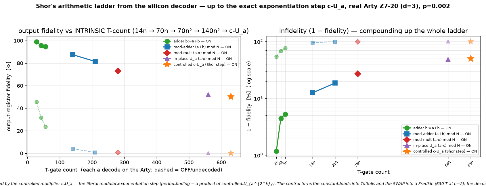

# Q6-32 (Milestone E) — The exact Shor exponentiation step from the decoder: controlled c-U_a

The arithmetic arc: adder (`qec-q6-adder.md`) → modular adder (`qec-q6-modadd.md`) → modular multiplier
(`qec-q6-mulmod.md`) → in-place `U_a` (`qec-q6-imul.md`). This runs the operation those were all building
toward: the **controlled** in-place modular multiplier **c-U_a**. Controlled on a phase-register qubit,
`|ctrl⟩|x⟩ → |ctrl⟩|(a·x) mod N if ctrl else x⟩`. Shor's period-finding is nothing but a product of
**controlled-U_{a^{2^k}}** against the phase register, so this is the literal modular-exponentiation step,
run end-to-end from the silicon decoder.

Adding the control makes the cost genuinely richer than U_a — and in exactly the way fault tolerance
predicts. In U_a the constant-loads were **free CNOTs** and the register exchange a **free SWAP**. Once
controlled on `ctrl`, each load becomes a **Toffoli** (`ctrl ∧ x[i]`) and the SWAP becomes a **Fredkin** —
both non-Clifford, both **DECODED** on the Arty. So c-U_a is two controlled out-of-place multiplies (forward
`a`, inverse `a⁻¹`) around a controlled SWAP, with a data-dependent T-count

    T = 7 · (20n²  +  n  +  2·Hamming(load constants))
          ╰VBE adders╯ ╰Fredkins╯ ╰controlled loads╯

= **630 T at n=2** (`N=3, a=2`: 80 VBE + 2 Fredkin + 8 load Toffolis = 90 Toffolis). When `ctrl=0` the whole
thing is the identity — every controlled load deposits 0, so every VBE adder is the identity and the Fredkin
is skipped. Every Toffoli (VBE-internal, load, and Fredkin alike) is a code-protected logical measurement
decoded on the real Arty (Q6-20 sliding-window bitstream `uf_arty_dma_win.bit`, unchanged). The verified
output is `x` unchanged for `ctrl=0` and `(a·x) mod N` in place for `ctrl=1`, with every scratch register
returned to 0.



## Result (real Arty Z7-20, d=3 W=9 C=3, uf_arty_dma_win.bit, 50 MHz, p=0.002)

| n | N | a | qubits (4n+4) | T-gate count | ON (decoder-corrected) | OFF (raw undecoded) | ON−OFF gap |
|---|---|---|---------------|--------------|------------------------|---------------------|------------|
| 2 | 3 | 2 | 12 | 630 | **50.31 %** | 0.12 % | 50 pp |

c-U_a is verified **exact off-board** (perfect decoder → identity on `ctrl=0` and `(a·x) mod N` on `ctrl=1`
for all 2N inputs — the self-check oracle) before the board, including **n=3 (16 qubits, 1407 T)**; n=3's
state-vector cost on the Arty's ARM core makes the board loop impractical, so the board run covers n=2 while
n=3 stands as an off-board-verified point at 1407 T. At 630 T-gates the undecoded OFF result has collapsed to
**~0.1 %** — with the added controlled Toffolis on top of U_a, essentially every raw shot carries an
uncorrected logical error. The decoder ran real-time throughout (worst 1.54 µs/window vs the 3 µs budget).

## Why this is the exponentiation step

Shor factors by estimating the phase of `U_a : |x⟩ → |a·x mod N⟩` — it applies **controlled-U_{a^{2^k}}**
for each phase-register bit `k`, then an inverse QFT. So modular exponentiation is *literally* a product of
the controlled multipliers demonstrated here. The five milestones (A–E) now trace Shor's exact arithmetic
stack from a plain addition all the way up to its top-level exponentiation primitive — every rung a real
algorithm with an intrinsic T-count, run end-to-end from the silicon decoder. And the control is not free:
it converts the cheap Clifford glue (loads, SWAP) into decoded Toffolis, which is exactly why a real
factoring run's T-count is dominated by these controlled-arithmetic layers — and why the `(1 − LER)^{N_T}`
decoder ceiling measured across the ladder is the quantitative core of the decoder-ASIC case.

## Reproduce

```bash
cargo run --release -p aleph-qec --example qec_q6_cmul -- 2 3 2 3 9 3 17 40 2024 0.002 > hw/cosim_cmul_n2.vec
cargo run --release -p aleph-qec --example qec_q6_cmul -- 3 7 3 3 9 3 17 28 2024 0.002 > hw/cosim_cmul_n3.vec
python3 hw/sw/uf_qubit_cmul.py --selfcheck hw/cosim_cmul_n2.vec   # controlled (a*x) mod N truth table EXACT
python3 hw/sw/uf_qubit_cmul.py --selfcheck hw/cosim_cmul_n3.vec   # n=3, 1407 T, EXACT off-board
scp -i ~/.ssh/arty_pynq hw/sw/uf_qubit_cmul.py hw/cosim_cmul_n2.vec xilinx@10.0.1.182:~/
ssh -i ~/.ssh/arty_pynq xilinx@10.0.1.182 \
  'sudo env XILINX_XRT=/usr /usr/local/share/pynq-venv/bin/python3 \
     uf_qubit_cmul.py uf_arty_dma_win.bit cosim_cmul_n2.vec --trials 40 | grep RESULT'
python3 hw/sw/plot_cmul.py    # -> docs/perf/qec-q6-cmul.png
```

Honest scope (unchanged from the Q6-25..32D arc): magic states are prepared directly, not distilled;
Cliffords are exact; the wrong-decode rate is the surface-code memory-LER. What is new here is the genuine
**Shor controlled-modular-multiplication step c-U_a** — the literal exponentiation primitive — running
end-to-end from the silicon decoder, with the control's own Toffoli/Fredkin cost decoded on silicon.

## Next levers

1. **A short modular exponentiation** — chain two or three controlled-U_{a^{2^k}} against a 2–3-qubit phase
   register (the front half of Shor before the inverse QFT); the T-count multiplies by the register width.
2. **d=7 / KV260** — a lower LER at the same p lifts the whole five-rung ladder, most visibly at c-U_a's
   high-T end.
3. **A faster board host** — the n=3 c-U_a (1407 T, 16 qubits) is off-board-verified only because of the
   Arty's ARM state-vector cost, not decoder throughput; a faster host would put it on silicon.
