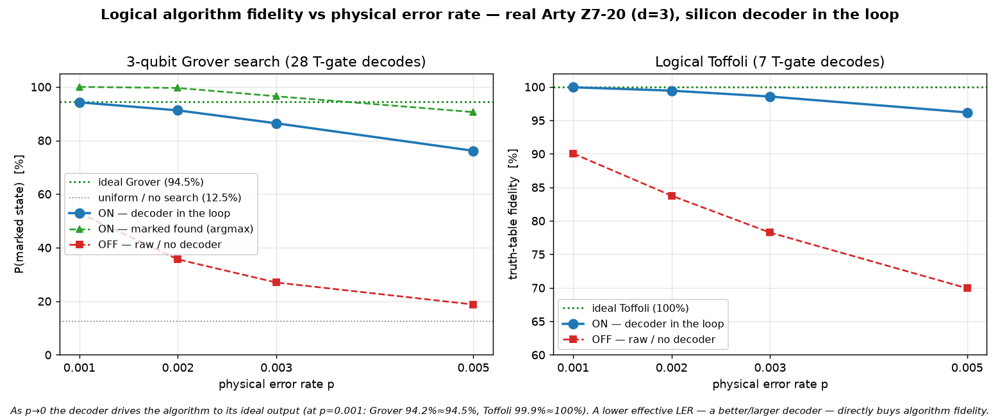

# Q6-29 — Algorithm fidelity vs physical error rate on real silicon

Follow-up to Q6-27/Q6-28 (logical Toffoli and 3-qubit Grover). This sweeps the physical error rate `p`
and runs the *same* algorithms end-to-end from the silicon decoder at each point, so the fidelity(p)
curve shows how the decoder operating point — equivalently, decoder quality / effective logical error
rate — sets the algorithm's output fidelity. It is the ASIC argument in data: **a lower effective LER
(a better or larger decoder) directly buys algorithm fidelity**, driving the output toward its ideal.

Reuses the Q6-27/Q6-28 emitters and board drivers unchanged; only the operating point varies. No new
gadget code.



## Result (real Arty Z7-20, d=3 W=9 C=3, uf_arty_dma_win.bit, 50 MHz)

3-qubit Grover (28 T-gate decodes, 256 searches/p, ideal 94.53 %):

| p | ON P(marked) | marked found (argmax) | OFF (no decoder) |
|-------|--------------|-----------------------|------------------|
| 0.001 | **94.24 %**  | 100.0 % | 52.95 % |
| 0.002 | 91.24 %      | 99.6 %  | 35.63 % |
| 0.003 | 86.41 %      | 96.5 %  | 26.99 % |
| 0.005 | 76.15 %      | 90.6 %  | 18.79 % |

Logical Toffoli (7 T-gate decodes, 800 trials/p, ideal 100 %):

| p | ON truth-table fidelity | OFF (no decoder) |
|-------|-------------------------|------------------|
| 0.001 | **99.94 %** | 90.06 % |
| 0.002 | 99.44 %     | 83.75 % |
| 0.003 | 98.56 %     | 78.25 % |
| 0.005 | 96.19 %     | 69.94 % |

At p=0.001 the decoder drives both algorithms to their ideal output (Grover 94.24 % ≈ 94.53 %; Toffoli
99.94 % ≈ 100 %). As noise rises the ON fidelity degrades gracefully while the undecoded OFF curve
collapses toward the uniform baseline (Grover 12.5 %) — so the decoder's value *grows* with noise. The
Grover marked-found rate stays ≥ 90 % across the whole sweep.

## Why this is the ASIC argument

The single free knob here is the effective logical error rate the decoder delivers. Lowering it — by a
lower physical `p`, a larger distance, or a better decoder — moves the algorithm monotonically toward
its ideal output. A decoder ASIC that sustains a low LER *at scale, in real time, at low power* is
therefore not a peripheral optimisation: it sets the fidelity ceiling of every logical algorithm the
machine can run. The 28-decode Grover shows the compounding: 28 magic-state injections, each a decode,
and the end-to-end fidelity tracks (1 − LER) raised to the gate count.

## Reproduce

```bash
for p in 0.001 0.002 0.003 0.005; do
  cargo run --release -p aleph-qec --example qec_q6_grover  -- 3 9 3 17 256 2024 $p > hw/cosim_grover_p$p.vec
  cargo run --release -p aleph-qec --example qec_q6_toffoli -- 3 9 3 17 800 2024 $p > hw/cosim_toffoli_p$p.vec
done
scp -i ~/.ssh/arty_pynq hw/sw/uf_qubit_grover.py hw/sw/uf_qubit_toffoli.py hw/sw/algo_fidelity_sweep.sh \
    hw/cosim_grover_p*.vec hw/cosim_toffoli_p*.vec xilinx@10.0.1.182:~/
ssh -i ~/.ssh/arty_pynq xilinx@10.0.1.182 'sudo env XILINX_XRT=/usr bash algo_fidelity_sweep.sh'   # CSV
python3 hw/sw/plot_fidelity_sweep.py    # -> docs/perf/qec-q6-fidelity-sweep.png
```

## Next levers

1. **d=7 / KV260** — extend the sweep with a higher-distance decoder: at fixed p the larger code yields
   a lower LER, so the curves shift up toward ideal — the distance-scaling half of the same argument.
2. **Larger algorithms** — more T-gates compound the (1−LER) factor, sharpening the decoder-quality
   dependence.
