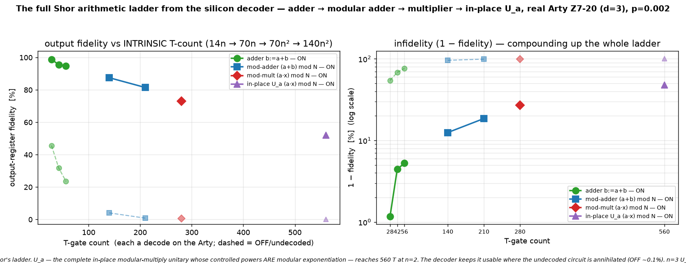

# Q6-32 (Milestone D) — The complete Shor multiplicative unitary from the decoder: in-place U_a

The arithmetic arc so far: plain adder (`qec-q6-adder.md`) → modular adder (`qec-q6-modadd.md`) → modular
multiplier (`qec-q6-mulmod.md`). This runs the **complete multiplicative unitary** at the top of Shor's
ladder: the **in-place modular multiplier** `x := (a·x) mod N` (`|x⟩ → |(a·x) mod N⟩`), i.e. exactly
**U_a** — the unitary whose *controlled powers* Shor's modular exponentiation is a product of. In-place
multiply is **two** out-of-place multiplies (forward by `a`, then clear-the-scratch by `a⁻¹`) around a
SWAP, so the T-count doubles again to **140n² T-gates** (560 for n=2, 1260 for n=3), 2n VBE adders deep —
and it stays at 4n+3 qubits by reusing the same two registers.

Construction (textbook Shor over VBE arithmetic), registers R1=x, R2=0:

- `R2 += a·R1 mod N` — n controlled-modular-adds of the constants `a·2^i mod N` → R1=x, R2=a·x
- SWAP R1 ↔ R2 (Clifford) → R1=a·x, R2=x
- `R2 −= a⁻¹·R1 mod N` — n controlled-modular-adds of `−(a⁻¹·2^i) mod N` → R1=a·x, R2=0

It requires `gcd(a,N)=1` so `a⁻¹` exists (checked at emit time). Modular subtract of `c` is modular add of
`(N−c) mod N`, so both passes reuse the **same** forward machinery with different classical constants. Each
modular add is one **unconditional** VBE adder (70n T = 10n Toffolis) — the identity when its addend is 0 —
so the whole in-place multiply is 2n VBE adders = **140n² Toffoli-borne T-gate magic-state measurements**,
each DECODED on the real Arty (Q6-20 sliding-window bitstream `uf_arty_dma_win.bit`, unchanged). All
control, constant-loading and the SWAP are Clifford (no decode). The verified output is R1 = `(a·x) mod N`
in place, with R2 and every scratch register back to 0.



## Result (real Arty Z7-20, d=3 W=9 C=3, uf_arty_dma_win.bit, 50 MHz, p=0.002)

| n | N | a | qubits (4n+3) | T-gate count | ON (decoder-corrected) | OFF (raw undecoded) | ON−OFF gap |
|---|---|---|---------------|--------------|------------------------|---------------------|------------|
| 2 | 3 | 2 | 11 | 560 | **52.08 %** | 0.10 % | 52 pp |

The n=2 unitary U_2 = `(2·x) mod 3` (a bijection on residues, 2⁻¹=2 mod 3) is verified **exact off-board**
(perfect decoder → correct in-place product for all N residues x, and R2 cleared to 0 — the self-check
oracle) before the board, as is **n=3 U_3 = `(3·x) mod 7` (15 qubits, 1260 T)**; n=3's state-vector cost on
the Arty's ARM core makes the board loop impractical, so the board run covers n=2 while n=3 stands as an
off-board-verified point at 1260 T. At 560 T-gates the undecoded OFF product has collapsed to **~0.1 %** (and
to ~0.01 % at 1260 T) — with 2n modular adders composed, essentially every raw shot carries an uncorrected
logical error, so the decoder's value is near-total. The decoder ran real-time throughout (worst 1.54
µs/window vs the 3 µs budget).

## Why this is the capstone of the arithmetic arc

`U_a` is the whole point: Shor's period-finding runs **controlled-U_{a^{2^k}}** against a phase register,
and modular exponentiation is nothing but a product of these in-place modular multiplications. So the four
milestones (A–D) trace Shor's exact arithmetic stack — ripple-carry addition (14n T) → modular addition
(70n) → modular multiplication (70n²) → **in-place modular multiplication U_a (140n²)** — each a real
algorithm whose T-count is intrinsic, run end-to-end from the silicon decoder. The `(1 − LER)^{N_T}` law
measured across all four is exactly what caps a real factoring run, with N_T in the millions. By U_a the
undecoded fidelity is ~0.1 % at n=2: without a low-LER decoder the Shor multiplicative core is unusable, and
shaving per-gate LER compounds over the full exponentiation. Running the genuine U_a unitary — not a
stand-in — from the silicon decoder is the milestone.

## Reproduce

```bash
cargo run --release -p aleph-qec --example qec_q6_imul -- 2 3 2 3 9 3 17 60 2024 0.002 > hw/cosim_imul_n2.vec
cargo run --release -p aleph-qec --example qec_q6_imul -- 3 7 3 3 9 3 17 35 2024 0.002 > hw/cosim_imul_n3.vec
python3 hw/sw/uf_qubit_imul.py --selfcheck hw/cosim_imul_n2.vec   # in-place (a*x) mod N truth table EXACT
python3 hw/sw/uf_qubit_imul.py --selfcheck hw/cosim_imul_n3.vec   # n=3, 1260 T, EXACT off-board
scp -i ~/.ssh/arty_pynq hw/sw/uf_qubit_imul.py hw/cosim_imul_n2.vec xilinx@10.0.1.182:~/
ssh -i ~/.ssh/arty_pynq xilinx@10.0.1.182 \
  'sudo env XILINX_XRT=/usr /usr/local/share/pynq-venv/bin/python3 \
     uf_qubit_imul.py uf_arty_dma_win.bit cosim_imul_n2.vec --trials 60 | grep RESULT'
python3 hw/sw/plot_imul.py    # -> docs/perf/qec-q6-imul.png
```

Honest scope (unchanged from the Q6-25..32C arc): magic states are prepared directly, not distilled;
Cliffords are exact; the wrong-decode rate is the surface-code memory-LER. What is new here is the genuine
**Shor in-place modular-multiplication unitary U_a** running end-to-end from the silicon decoder at an
intrinsic, doubled T-count (140n²).

## Next levers

1. **Controlled-U_a** — the exact Shor exponentiation step (wrap U_a in an outer control on a phase-register
   qubit); the T-count and qubit budget grow, but the primitive is identical.
2. **d=7 / KV260** — a lower LER at the same p lifts the whole four-rung ladder, most visibly at the high-T
   end where U_a sits.
3. **A faster board host** — the n=3 U_a (1260 T, 15 qubits) is off-board-verified only because of the
   Arty's ARM state-vector cost, not decoder throughput; a faster host would put it on silicon.
