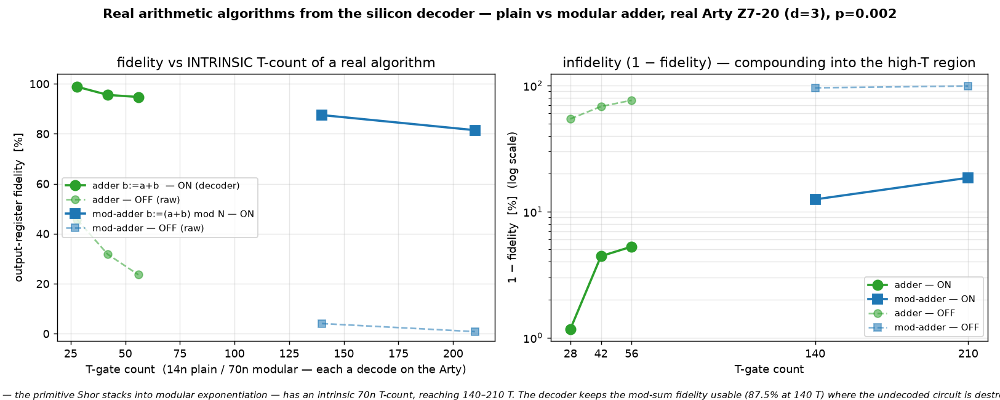

# Q6-32 (Milestone B) — The Shor-relevant primitive from the decoder: the modular adder

Milestone A (`docs/perf/qec-q6-adder.md`) ran a plain ripple-carry adder `b := a + b` end-to-end from the
silicon decoder. This runs the next primitive up the Shor stack: the **modular adder** `b := (a + b) mod N`
(Vedral-Barenco-Ekert, arXiv:quant-ph/9511018) — the operation Shor's algorithm composes into modular
multiplication and then modular exponentiation. Its T-count is not just intrinsic but **deep**: 70n
T-gates (140/210/280 for n = 2/3/4), 2.5–5× the plain adder, genuinely into the high-T region.

The VBE modular adder is **five ripple-carry (Cuccaro) adders + a conditional subtract of N**, in order:
`b += a`; `b -= N`; `t ← overflow(b)`; `b += (t? N : 0)`; `b -= a`; reset `t`; `b += a`. Each Cuccaro
add/sub is 2n Toffolis, so five adders are 10n Toffolis = **70n T-gates**, each a code-protected logical
measurement DECODED on the real Arty (Q6-20 sliding-window bitstream `uf_arty_dma_win.bit`, unchanged).
X/CNOT — including the classical-N load (X gates) and the t-controlled add-back (CNOTs from `t`) — are
Clifford and are not decoded. Subtraction is the Cuccaro adder's gate list reversed (Toffoli is
self-inverse). The verified output is `b := (a+b) mod N`, with `a`, the N-scratch, the carry, the overflow
bit, and `t` all restored.



## Result (real Arty Z7-20, d=3 W=9 C=3, uf_arty_dma_win.bit, 50 MHz, p=0.002)

| n | N | qubits (3n+3) | T-gate count | ON (decoder-corrected) | OFF (raw undecoded) | ON−OFF gap |
|---|---|---------------|--------------|------------------------|---------------------|------------|
| 2 | 3 | 9  | 140 | **87.50 %** | 4.06 % | 83 pp |
| 3 | 7 | 12 | 210 | 81.46 % | 0.83 % | 81 pp |

Every modular adder is verified **exact off-board** (perfect decoder → `b := (a+b) mod N` for all N² valid
input pairs a,b < N — the self-check oracle) before it touches the board; n=4 (N=15, 15 qubits, 280 T) is
verified exact off-board too, but its state-vector cost on the Arty's ARM core makes the board loop
impractical, so the board runs cover n=2,3. On silicon, the decoder holds the mod-sum fidelity usable deep
in the high-T region (87.5 % at 140 T), while the **undecoded OFF is essentially destroyed** (4.06 % → ~1 %)
— at 140–210 T-gates almost every raw shot has at least one uncorrected logical error, so the ON−OFF gap is
enormous. The decoder ran real-time throughout (worst 1.54 µs/window vs the 3 µs commit budget).

## Why this is the milestone that matters

The plain adder (Milestone A) already made the compounding argument with a real circuit. The modular adder
closes the loop to Shor: modular exponentiation — the quantum-costly heart of factoring — is a tower of
exactly these modular additions, so the `(1 − LER)^{N_T}` law measured here is precisely what sets the
fidelity ceiling of a real factoring run, with N_T in the millions. At just n=2 the undecoded fidelity has
already collapsed to 4 %; without a low-LER decoder the modular-arithmetic core is unusable, and the value
of shaving per-gate LER compounds over the full exponentiation. Running the genuine Shor primitive
end-to-end from the silicon decoder — not a synthetic gadget — is the point.

## Reproduce

```bash
cargo run --release -p aleph-qec --example qec_q6_modadd -- 2 3 3 9 3 17 128 2024 0.002 > hw/cosim_modadd_n2.vec
cargo run --release -p aleph-qec --example qec_q6_modadd -- 3 7 3 9 3 17 60  2024 0.002 > hw/cosim_modadd_n3.vec
python3 hw/sw/uf_qubit_modadd.py --selfcheck hw/cosim_modadd_n2.vec   # (a+b) mod N truth table EXACT
scp -i ~/.ssh/arty_pynq hw/sw/uf_qubit_modadd.py hw/cosim_modadd_n*.vec xilinx@10.0.1.182:~/
ssh -i ~/.ssh/arty_pynq xilinx@10.0.1.182 \
  'for f in n2 n3; do sudo env XILINX_XRT=/usr /usr/local/share/pynq-venv/bin/python3 \
     uf_qubit_modadd.py uf_arty_dma_win.bit cosim_modadd_$f.vec | grep RESULT; done'
python3 hw/sw/plot_modadd.py    # -> docs/perf/qec-q6-modadd.png
```

Honest scope (unchanged from the Q6-25..32A arc): magic states are prepared directly, not distilled;
Cliffords are exact; the wrong-decode rate is the surface-code memory-LER. What is new here is the genuine
**Shor modular-arithmetic primitive** running end-to-end from the silicon decoder at an intrinsic, deep
T-count (70n).

## Next levers

1. **Modular multiplier / controlled-modular-add** — the next layer of Shor's ladder, built from these
   modular adders; the T-count climbs another order.
2. **d=7 / KV260** — a lower LER at the same p lifts the whole curve, most visibly at the high-T end.
3. **Place both adders on the Q6-31 fidelity(p, T-count) surface** as labelled real-algorithm samples.
