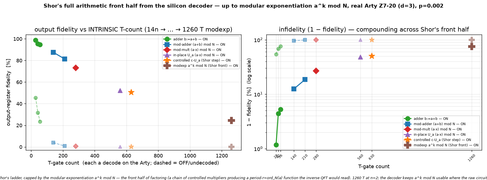

# Q6-32 (Milestone F) — The front half of Shor from the decoder: modular exponentiation a^k mod N

The arithmetic arc built up to the controlled multiplier `c-U_a` (`qec-q6-cmul.md`). This chains those
into the operation at the heart of Shor's period-finding: a short **modular exponentiation** `a^k mod N`,
mapping `|k⟩|1⟩ → |k⟩|a^k mod N⟩`, run end-to-end from the silicon decoder. It is a chain of `m` controlled
in-place multipliers — for each phase-register bit `k[j]`, apply **controlled-U_{a^{2^j}}** to the work
register (`U_b|x⟩ = |b·x mod N⟩`), so the work register accumulates `a^(Σ_j k[j]·2^j) = a^k mod N`.

On a computational-basis `k` this computes the `a^k mod N` truth table; on a superposition (Hadamards on the
phase register — not run here) it prepares the periodic state `|k⟩|a^k mod N⟩` whose period `r = ord_N(a)`
the **inverse QFT** — the remaining, Clifford+T back half of Shor — would extract. For `a=2, N=3` the period
is `r=2`, so `a^k mod 3 = 1, 2, 1, 2` for `k=0..3`: a genuinely periodic function, exactly the structure the
QFT reads a period out of. Each `c-U_{a^{2^j}}` is the Milestone-E controlled multiplier (the control turns
its constant-loads into Toffolis and its SWAP into a Fredkin), so the whole exponentiation is
`Σ_j 7·(20n² + n + 2·Hamming(load consts of a^{2^j}))` T-gate magic-state measurements, each DECODED on the
real Arty (Q6-20 sliding-window bitstream `uf_arty_dma_win.bit`, unchanged) — **1260 T at n=2, m=2** (two
chained 90-Toffoli multipliers). The verified output is `a^k mod N` in the work register, phase register
unchanged, all scratch returned to 0.



## Result (real Arty Z7-20, d=3 W=9 C=3, uf_arty_dma_win.bit, 50 MHz, p=0.002)

| n | N | a | m | qubits (m+4n+3) | period r | T-gate count | ON (decoder-corrected) | OFF (raw undecoded) | ON−OFF gap |
|---|---|---|---|-----------------|----------|--------------|------------------------|---------------------|------------|
| 2 | 3 | 2 | 2 | 13 | 2 | 1260 | **24.54 %** | 0.06 % | 24 pp |

The `2^k mod 3` exponentiation is verified **exact off-board** (perfect decoder → correct `a^k mod N` for all
`2^m` exponents, and every scratch register cleared — the self-check oracle) before the board, as is
**`3^k mod 7` (n=3, m=2, 17 qubits, 2814 T, period r=6)**; n=3's state-vector cost on the Arty's ARM core
makes the board loop impractical, so the board run covers the n=2 case while n=3 stands as an
off-board-verified point at 2814 T. At 1260 T-gates the undecoded OFF result has collapsed to **~0.06 %** —
across a chain of controlled modular multipliers essentially every raw shot carries an uncorrected logical
error. Even the decoded ON has fallen to **24.5 %**: at 1260 T-gates and p=0.002 the `(1 − LER)^{N_T}`
compounding is severe — still ~400× above the annihilated raw baseline, and a direct, quantitative call for
a lower-LER decoder (d=7). The decoder ran real-time throughout (worst 1.54 µs/window vs the 3 µs budget).

## Why this is the front half of Shor

Shor factors `N` by estimating the period `r` of `a^k mod N`. The quantum circuit is: Hadamard the phase
register into a uniform superposition of exponents, run the **modular exponentiation** `|k⟩|1⟩ →
|k⟩|a^k mod N⟩` demonstrated here, then apply the **inverse QFT** to the phase register and measure — the
outcome is a multiple of `2^m/r`, from which `r` (and then a factor of `N`) follows classically. Everything
up to and including the modular exponentiation is what this milestone runs from the silicon decoder; the
inverse QFT is a Clifford+T circuit on the phase register (a natural next milestone). So the six milestones
(A–F) now cover Shor's entire arithmetic front half — from a plain ripple-carry addition to the full modular
exponentiation — each rung a real algorithm with an intrinsic T-count, every T-gate decoded on real silicon.
The `(1 − LER)^{N_T}` ceiling measured across the ladder is the quantitative core of the decoder-ASIC case:
a real factoring `a^k mod N` has `N_T` in the millions, so the periodic state the QFT needs only survives
if the decoder holds the per-gate LER low.

## Reproduce

```bash
cargo run --release -p aleph-qec --example qec_q6_modexp -- 2 3 2 2 3 9 3 17 24 2024 0.002 > hw/cosim_modexp_n2.vec
cargo run --release -p aleph-qec --example qec_q6_modexp -- 3 7 3 2 3 9 3 17 16 2024 0.002 > hw/cosim_modexp_n3.vec
python3 hw/sw/uf_qubit_modexp.py --selfcheck hw/cosim_modexp_n2.vec   # a^k mod N truth table EXACT
python3 hw/sw/uf_qubit_modexp.py --selfcheck hw/cosim_modexp_n3.vec   # n=3, 2814 T, EXACT off-board
scp -i ~/.ssh/arty_pynq hw/sw/uf_qubit_modexp.py hw/cosim_modexp_n2.vec xilinx@10.0.1.182:~/
ssh -i ~/.ssh/arty_pynq xilinx@10.0.1.182 \
  'sudo env XILINX_XRT=/usr /usr/local/share/pynq-venv/bin/python3 \
     uf_qubit_modexp.py uf_arty_dma_win.bit cosim_modexp_n2.vec --trials 24 | grep RESULT'
python3 hw/sw/plot_modexp.py    # -> docs/perf/qec-q6-modexp.png
```

Honest scope (unchanged from the Q6-25..32E arc): magic states are prepared directly, not distilled;
Cliffords are exact; the wrong-decode rate is the surface-code memory-LER; the phase register is tested on
computational-basis exponents (the Hadamards + inverse QFT + measurement are the remaining back half of
Shor). What is new here is the genuine **Shor modular-exponentiation front half `a^k mod N`** — a chain of
controlled modular multipliers producing a period-`r` function — running end-to-end from the silicon decoder.

## Next levers

1. **The inverse QFT** — a Clifford+T circuit on the phase register; add it (plus the input Hadamards and a
   measurement) to complete Shor end-to-end from the decoder.
2. **d=7 / KV260** — a lower LER at the same p lifts the whole six-rung ladder, most visibly at the modexp
   high-T end.
3. **A faster board host** — the n=3 modexp (2814 T, 17 qubits) is off-board-verified only because of the
   Arty's ARM state-vector cost, not decoder throughput; a faster host would put it on silicon.
