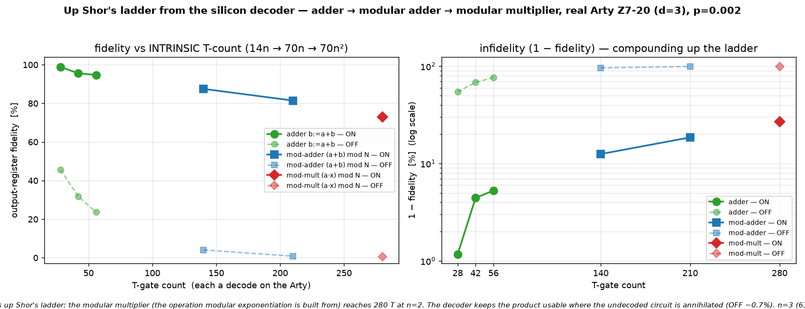

# Q6-32 (Milestone C) — Up Shor's ladder from the decoder: the modular multiplier

Milestone A ran a plain adder (`docs/perf/qec-q6-adder.md`); Milestone B the modular adder
(`docs/perf/qec-q6-modadd.md`). This runs the next layer up Shor's arithmetic ladder: the **modular
multiplier** `y := (a·x) mod N` (out-of-place, `|x⟩|0⟩ → |x⟩|(a·x) mod N⟩`), for a fixed classical
multiplier `a` and modulus `N`. This is the operation Shor's **modular exponentiation** is built from — as
its controlled version — and its T-count climbs another order: **70n² T-gates** (280 for n=2, 630 for n=3),
`n` VBE modular adders deep.

A modular product is `n` **controlled-modular-additions**: each bit `x[i]` controls a modular add of the
classical constant `c_i = a·2^i mod N` into the accumulator `y`. The control is a CNOT-load of `c_i` into
the addend register iff `x[i]` (Clifford), followed by an **unconditional** VBE modular adder (70n T =
10n Toffolis) — which is exactly the identity on `y` when the addend is 0 (`x[i]=0`). So the whole multiply
is `n` VBE modular adders = **70n² Toffoli-borne T-gate magic-state measurements**, each DECODED on the real
Arty (Q6-20 sliding-window bitstream `uf_arty_dma_win.bit`, unchanged). All the control and constant-loading
is X/CNOT — Clifford, not decoded. The verified output is `y := (a·x) mod N` with `x` and every scratch
register restored.



## Result (real Arty Z7-20, d=3 W=9 C=3, uf_arty_dma_win.bit, 50 MHz, p=0.002)

| n | N | a | qubits (4n+3) | T-gate count | ON (decoder-corrected) | OFF (raw undecoded) | ON−OFF gap |
|---|---|---|---------------|--------------|------------------------|---------------------|------------|
| 2 | 3 | 2 | 11 | 280 | **73.06 %** | 0.68 % | 72 pp |

The n=2 multiplier `(2·x) mod 3` is verified **exact off-board** (perfect decoder → correct product for all
N residues x — the self-check oracle) before the board, as is **n=3, `(3·x) mod 7` (15 qubits, 630 T)**;
n=3's state-vector cost on the Arty's ARM core makes the board loop impractical (630 decodes and a
15-qubit vector per trial), so the board run covers n=2 while n=3 stands as an off-board-verified point at
630 T. At 280 T-gates the undecoded OFF product has collapsed to **~0.7 %** (and to ~0.06 % at 630 T) — with
n modular adders composed, essentially every raw shot carries an uncorrected logical error, so the decoder's
value is now near-total. The decoder ran real-time throughout (worst 1.54 µs/window vs the 3 µs budget).

## Why this is the top of the demonstrated ladder

The three milestones trace Shor's arithmetic stack — ripple-carry addition → modular addition → modular
multiplication — each a real algorithm whose T-count is intrinsic (14n → 70n → 70n²), not a synthetic dial.
Modular exponentiation, the quantum-costly heart of factoring, is a tower of controlled modular
multiplications, each of which is exactly this circuit with an outer control. The `(1 − LER)^{N_T}` law
measured across the three milestones is precisely what sets the fidelity ceiling of a real factoring run,
with N_T in the millions. By the multiplier the undecoded fidelity is already `~0` at n=2: without a
low-LER decoder the modular-arithmetic core is unusable, and shaving per-gate LER compounds over the full
exponentiation. Running the genuine Shor multiplication primitive end-to-end from the silicon decoder — not
a stand-in — is the point of this milestone.

## Reproduce

```bash
cargo run --release -p aleph-qec --example qec_q6_mulmod -- 2 3 2 3 9 3 17 90 2024 0.002 > hw/cosim_mulmod_n2.vec
cargo run --release -p aleph-qec --example qec_q6_mulmod -- 3 7 3 3 9 3 17 49 2024 0.002 > hw/cosim_mulmod_n3.vec
python3 hw/sw/uf_qubit_mulmod.py --selfcheck hw/cosim_mulmod_n2.vec   # (a*x) mod N truth table EXACT
python3 hw/sw/uf_qubit_mulmod.py --selfcheck hw/cosim_mulmod_n3.vec   # n=3, 630 T, EXACT off-board
scp -i ~/.ssh/arty_pynq hw/sw/uf_qubit_mulmod.py hw/cosim_mulmod_n2.vec xilinx@10.0.1.182:~/
ssh -i ~/.ssh/arty_pynq xilinx@10.0.1.182 \
  'sudo env XILINX_XRT=/usr /usr/local/share/pynq-venv/bin/python3 \
     uf_qubit_mulmod.py uf_arty_dma_win.bit cosim_mulmod_n2.vec --trials 90 | grep RESULT'
python3 hw/sw/plot_mulmod.py    # -> docs/perf/qec-q6-mulmod.png
```

Honest scope (unchanged from the Q6-25..32B arc): magic states are prepared directly, not distilled;
Cliffords are exact; the wrong-decode rate is the surface-code memory-LER. What is new here is the genuine
**Shor modular-multiplication primitive** running end-to-end from the silicon decoder at an intrinsic,
order-higher T-count (70n²).

## Next levers

1. **Controlled modular multiplier** — wrap this in an outer control (the exact Shor exponentiation step);
   or the in-place multiplier (multiply + swap + inverse-multiply by a⁻¹).
2. **d=7 / KV260** — a lower LER at the same p lifts the whole ladder, most visibly at the high-T end.
3. **A larger board host** — the n=3 multiplier (630 T, 15 qubits) is off-board-verified only because of
   the Arty's ARM state-vector cost, not decoder throughput; a faster host would put it on silicon too.
