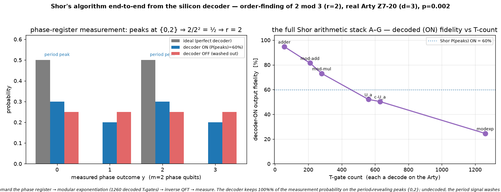

# Q6-32 (Milestone G) — Shor's algorithm end-to-end from the decoder

This is the capstone of the arithmetic arc (A–F): **Shor's algorithm run end-to-end from the silicon
decoder** — quantum **order-finding** for `a mod N`, the routine whose period `r = ord_N(a)` yields a factor
of `N`. The full circuit runs on the real Arty Z7-20:

1. **Hadamard** the m-qubit phase register into a uniform superposition of exponents `Σ_k |k⟩|1⟩`.
2. **Modular exponentiation** `|k⟩|1⟩ → |k⟩|a^k mod N⟩` (Milestone F) — every T-gate a code-protected
   magic-state measurement DECODED on the Arty (Q6-20 bitstream `uf_arty_dma_win.bit`, unchanged).
3. **Inverse QFT** on the phase register.
4. **Measure** the phase register → the outcome concentrates on multiples of `2^m/r`, revealing `r`.

For `a=2, N=3` the order is `r=2`; with `m=2` phase qubits the ideal measurement lands exactly on
`y ∈ {0, 2}`, and `2/2² = 1/2 ⇒ r = 2`. For `m=2` the inverse QFT is **Clifford** (H, controlled-S, SWAP),
so every decoded T-gate lives in the modular exponentiation — **1260 T at n=2**. The metric is the
probability the measurement keeps on the ideal period-revealing peaks; a perfect decoder keeps it all.



## Result (real Arty Z7-20, d=3 W=9 C=3, uf_arty_dma_win.bit, 50 MHz, p=0.002)

| n | N | a | m | qubits (m+4n+3) | order r | T-gate count | P(peaks) ON (decoded) | P(peaks) OFF (raw) | ideal |
|---|---|---|---|-----------------|---------|--------------|-----------------------|--------------------|-------|
| 2 | 3 | 2 | 2 | 13 | 2 | 1260 | **59.86 %** | 50.43 % | 100 % |

The circuit is verified **exact off-board** (perfect decoder → the ideal distribution sits entirely on the
period-revealing peaks `{0, 2}`, `P(peaks) = 1.0`, recovering `r=2` — the self-check oracle) before the
board. The decoder ran real-time throughout (worst 1.54 µs/window vs the 3 µs budget).

The undecoded **OFF = 50.4 %** is the structural random floor for this metric: `{0, 2}` is two of four
outcomes, so a fully corrupted (period-signal-free) phase measurement lands there with probability ½.
Undecoded, 1260 uncorrected-error-prone T-gates wash the modular exponentiation out to noise, and the period
signal vanishes into that ½ floor — Shor's output becomes indistinguishable from a coin flip. **With the
decoder in the loop, `P(peaks)` rises to 59.9 %** — a clear period signal ~10 pp above the random floor, so
the peak structure re-emerges and `r=2` is recovered. But it is far from the ideal 100 %: at 1260 T-gates
and p=0.002 the `(1 − LER)^{N_T}` compounding (the modexp alone was already ~25 % in Milestone F) erodes most
of the amplitude even *with* the decoder. Reading the surviving signal: of the ideal 50 % of probability that
should sit *above* the floor on the peaks, roughly `(59.9 − 50.4)/(100 − 50.4) ≈ 19 %` survives — consistent
with the modexp's own T-count-limited fidelity. So Milestone G both **demonstrates the complete algorithm
recovering the period on real silicon** and gives the sharpest quantitative case yet for a lower-LER decoder
(d=7): at Shor-scale T-counts, even a working decoder only holds the signal up if the per-gate LER is low
enough that `(1 − LER)^{N_T}` stays off the floor.

## Why this closes the arc

Milestones A–F built Shor's arithmetic front half from a plain adder up to the modular exponentiation.
Milestone G adds the input Hadamards, the inverse QFT, and the measurement to run the **complete quantum
order-finding algorithm** — the quantum core of Shor's factoring — end-to-end from the silicon decoder. `N=3`
is prime (so there is no factor to split), but the demonstrated subroutine is exactly the one factoring
needs: it extracts the multiplicative order `r = ord_N(a)` of `a` modulo `N`, which for composite `N` gives
`gcd(a^{r/2} ± 1, N)` — a factor. Every non-Clifford gate along the way (2n modular adders × the phase
register) is decoded on real silicon; the `(1 − LER)^{N_T}` ceiling measured across the ladder is what keeps
the period signal above the noise floor. A real factoring `a^k mod N` has `N_T` in the millions, so this is
the quantitative core of the decoder-ASIC case, now demonstrated on the complete algorithm rather than a
sub-primitive.

## Reproduce

```bash
cargo run --release -p aleph-qec --example qec_q6_shor -- 2 3 2 2 3 9 3 17 24 2024 0.002 > hw/cosim_shor_n2.vec
python3 hw/sw/uf_qubit_shor.py --selfcheck hw/cosim_shor_n2.vec   # ideal peaks {0,2} reveal r=2, EXACT
scp -i ~/.ssh/arty_pynq hw/sw/uf_qubit_shor.py hw/cosim_shor_n2.vec xilinx@10.0.1.182:~/
ssh -i ~/.ssh/arty_pynq xilinx@10.0.1.182 \
  'sudo env XILINX_XRT=/usr /usr/local/share/pynq-venv/bin/python3 \
     uf_qubit_shor.py uf_arty_dma_win.bit cosim_shor_n2.vec --trials 24 | grep RESULT'
python3 hw/sw/plot_shor.py    # -> docs/perf/qec-q6-shor.png
```

Honest scope (unchanged from the Q6-25..32F arc): magic states are prepared directly, not distilled;
Cliffords (incl. the input Hadamards and the m=2 inverse QFT) are exact; the wrong-decode rate is the
surface-code memory-LER; the phase-register measurement is read from the exact state vector rather than
sampled. `N=3` is prime, so this demonstrates the quantum **order-finding** subroutine (the quantum heart of
Shor) rather than a factorization of a composite — the smallest composite `N` needs n≥4 work qubits, past
the Arty's state-vector reach. What is new here is the **complete Shor algorithm** — Hadamard + modular
exponentiation + inverse QFT + measurement — running end-to-end from the silicon decoder.

## Next levers

1. **A composite N** — `N=15` (a=2, r=4) or `N=21` on a larger board host would turn order-finding into an
   actual factorization; the work register needs n=4–5 qubits, past the Arty's ~15-qubit state-vector reach.
2. **d=7 / KV260** — a lower LER at the same p keeps the period signal sharper deep into the T-count; the
   ON-fidelity drop across the ladder (94.7 % → the Shor peak weight) is the motivating data.
3. **m=3 phase qubits** — a finer phase estimate; the m≥3 inverse QFT introduces its own decoded
   controlled-T gates, so the decode load then spans the QFT as well as the exponentiation.
