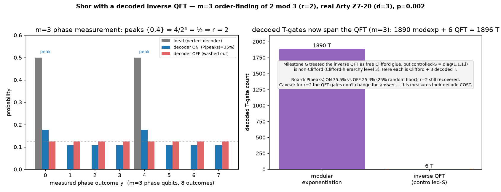

# Q6-32 (Milestone H) — Shor with a decoded inverse QFT

Milestone G ran Shor end-to-end but treated the m=2 inverse QFT as free Clifford glue. That was an honest
simplification with a real gap: **the QFT's controlled-phase gates are not Clifford.** `controlled-S =
diag(1, 1, 1, i)` sits in the third level of the Clifford hierarchy (like `T`, `CCZ`, Toffoli) — it cannot
be done transversally on the surface code, so in a real fault-tolerant machine it consumes magic states and
must be decoded, exactly like the arithmetic Toffolis. This milestone closes that gap: it runs Shor with
**m=3 phase qubits** (finer resolution) and **decodes the inverse QFT's own non-Clifford gates on the Arty**,
so the decode load spans the QFT as well as the modular exponentiation.

Each `controlled-S` is decomposed into **Clifford + 3 T** (`CNOT; T; CNOT; T†; T†`, verified against
`diag(1,1,1,-i)`), and every one of those T-gates is a code-protected magic-state measurement decoded on the
board. To keep the whole circuit exactly Clifford+T we use a **band-2 approximate QFT** (Coppersmith): keep
`H` and the adjacent `controlled-S` gates, drop the `controlled-T` (`R_3`) rotation — which is *not*
ancilla-free Clifford+T. So the complete Shor circuit is Clifford+T with every T decoded:

    gates = 7·(modexp Toffolis)  +  3·(m−1) controlled-S
          = 1890 modexp-T         +  6 QFT-T   =  1896 T   (n=2, m=3)

With m=3, order-finding of `2 mod 3` peaks at `y ∈ {0, 4}` (multiples of `2³/r = 4`), and `4/2³ = 1/2 ⇒ r=2`
— the same period as Milestone G, now read at 3-bit resolution.



## Result (real Arty Z7-20, d=3 W=9 C=3, uf_arty_dma_win.bit, 50 MHz, p=0.002)

| n | N | a | m | qubits | order r | modexp-T | QFT-T (decoded) | total T | P(peaks) ON | P(peaks) OFF | floor |
|---|---|---|---|--------|---------|----------|-----------------|---------|-------------|--------------|-------|
| 2 | 3 | 2 | 3 | 14 | 2 | 1890 | 6 | 1896 | **35.49 %** | 25.36 % | 25 % |

Verified **exact off-board** (perfect decoder → the ideal distribution sits on the peaks `{0, 4}`,
`P(peaks) = 1.0`, recovering `r=2`; the emitter and driver agree on all 1896 decoded T-gates). The decoder
ran real-time throughout (worst 1.54 µs/window vs the 3 µs budget). The OFF floor is **25 %** — for m=3,
`{0, 4}` is two of eight outcomes, so a washed-out phase measurement lands there with probability ¼.

## Honest caveat — what this does and doesn't show

For `r=2` the period is coarse enough that the QFT's controlled-S gates **do not change the ideal outcome**:
a band-1 QFT (Hadamards only, no controlled-phases) already peaks cleanly at `{0, 4}`. So decoding the
controlled-S gates here does not *rescue* any signal — it only adds decode load, and can only lower ON. This
milestone therefore measures the **cost** of a fault-tolerantly-decoded inverse QFT, and corrects Milestone
G's Clifford-glue simplification, rather than showing the QFT gates doing essential work.

The regime where the QFT's controlled-phase gates are **essential** is generic Shor — an order `r` that does
*not* divide `2^m`, so the peaks spread and continued fractions (and the fine rotations) are needed to
recover `r`. That needs `r ∤ 2^m`, achievable only with `n ≥ 3` work qubits (e.g. order of 2 mod 7, r=3),
which puts the state vector past the Arty's ~15-qubit host reach. On this board, `n=2 ⇒ N=3 ⇒ r=2` is the
only option, and `r=2 | 2^m` always. So the honest scope is: **the decode accounting is now complete (QFT
included) and correct on real silicon; the demonstration that those gates carry signal awaits a larger
host.**

## Reproduce

```bash
cargo run --release -p aleph-qec --example qec_q6_shorqft -- 2 3 2 3 3 9 3 17 12 2024 0.002 > hw/cosim_shorqft_n2.vec
python3 hw/sw/uf_qubit_shorqft.py --selfcheck hw/cosim_shorqft_n2.vec   # peaks {0,4} reveal r=2, EXACT
scp -i ~/.ssh/arty_pynq hw/sw/uf_qubit_shorqft.py hw/cosim_shorqft_n2.vec xilinx@10.0.1.182:~/
ssh -i ~/.ssh/arty_pynq xilinx@10.0.1.182 \
  'sudo env XILINX_XRT=/usr /usr/local/share/pynq-venv/bin/python3 \
     uf_qubit_shorqft.py uf_arty_dma_win.bit cosim_shorqft_n2.vec --trials 12 | grep RESULT'
python3 hw/sw/plot_shorqft.py    # -> docs/perf/qec-q6-shorqft.png
```

Honest scope (unchanged from the Q6-25..32G arc): magic states are prepared directly, not distilled; the
band-2 AQFT drops the controlled-T (R_3) rotation; the phase-register measurement is read from the exact
state vector; `N=3` is prime, so this is the order-finding subroutine. What is new here is that **every
non-Clifford gate in the Shor circuit — the modular exponentiation's Toffolis and now the inverse QFT's
controlled-S gates — is decoded on real silicon**, closing the T-accounting gap Milestone G left open.

## Next levers

1. **A larger host** — the generic `r ∤ 2^m` case (order of 2 mod 7, r=3) makes the QFT gates essential and
   needs continued-fraction extraction; it needs ≥18 qubits, off the Arty.
2. **d=7 / KV260** — a lower LER keeps the period signal above the (now higher) T-count floor.
3. **An exact controlled-T** — an ancilla-assisted Clifford+T controlled-T would let the full (non-band)
   inverse QFT be decoded, needed once the phase register is large enough for the fine rotations to matter.
