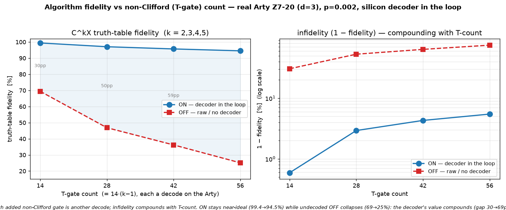

# Q6-30 — Larger algorithms: T-gate-count scaling on real silicon

Follow-up to Q6-29 (fidelity vs physical error rate). This holds `p` fixed and scales the **T-gate
count** instead, running a multi-controlled-X (C^kX) end-to-end from the silicon decoder for k = 2..5.
It shows the (1−LER) **compounding**: more non-Clifford gates → sharper dependence on decoder quality,
and a decoder-value gap that widens with circuit size.

C^kX — the multi-controlled-X at the heart of Grover oracles and reversible arithmetic — is built from
a compute/uncompute cascade of 2(k−1) Toffolis on (k−1) ancillas; each Toffoli = 7 T/T† gates (Q6-27).
So the circuit is **14(k−1) T-gate magic-state injections**, each a code-protected logical measurement
DECODED on the real Arty (Q6-20 bitstream unchanged). X/CNOT are Clifford (no decode). Sweeping k gives
a clean T-count ladder 14, 28, 42, 56, and the output is the deterministic C^kX truth table (target
flips iff all k controls are 1).



## Result (real Arty Z7-20, d=3 W=9 C=3, uf_arty_dma_win.bit, 50 MHz, p=0.002, 256 trials/point)

| k | T-gate count | ON (decoder-corrected) | OFF (raw undecoded) | ON−OFF gap |
|---|--------------|------------------------|---------------------|------------|
| 2 | 14 | **99.41 %** | 69.43 % | 30 pp |
| 3 | 28 | 97.07 % | 46.87 % | 50 pp |
| 4 | 42 | 95.70 % | 36.21 % | 59 pp |
| 5 | 56 | **94.53 %** | 25.12 % | **69 pp** |

Every C^kX circuit is verified exact off-board (perfect decoder → 100 % on all 2^k control inputs), so
the only unknown on the board is the decoder. On silicon, the decoder holds ON near-ideal as the T-count
quadruples (99.4 % → 94.5 %), while the undecoded OFF collapses (69 % → 25 %) toward the corrupted
baseline. The infidelity (1 − fidelity) compounds with T-count on both curves, but far faster without
the decoder — so the **decoder-value gap widens with circuit size** (30 pp → 69 pp).

## Why this sharpens the ASIC argument

Q6-29 showed fidelity → ideal as the effective LER drops. Q6-30 shows the other axis: at fixed LER, the
end-to-end fidelity of a logical algorithm falls with its non-Clifford gate count, roughly
(1 − ε)^{N_T}. Real algorithms have large T-counts (millions for Shor/chemistry), so the fidelity
ceiling set by the decoder's LER is not a constant discount — it is raised to the gate-count power. A
decoder that shaves the per-gate LER pays off *super-linearly* over a real workload. That compounding is
the quantitative core of the decoder-ASIC case.

## Reproduce

```bash
for k in 2 3 4 5; do
  cargo run --release -p aleph-qec --example qec_q6_mcx -- $k 3 9 3 17 256 2024 0.002 > hw/cosim_mcx_k$k.vec
done
python3 hw/sw/uf_qubit_mcx.py --selfcheck hw/cosim_mcx_k3.vec        # C^kX truth table EXACT
scp -i ~/.ssh/arty_pynq hw/sw/uf_qubit_mcx.py hw/cosim_mcx_k*.vec xilinx@10.0.1.182:~/
ssh -i ~/.ssh/arty_pynq xilinx@10.0.1.182 \
  'for k in 2 3 4 5; do sudo env XILINX_XRT=/usr /usr/local/share/pynq-venv/bin/python3 \
     uf_qubit_mcx.py uf_arty_dma_win.bit cosim_mcx_k$k.vec --trials 256 | grep RESULT; done'
python3 hw/sw/plot_tcount_scaling.py    # -> docs/perf/qec-q6-tcount-scaling.png
```

## Next levers

1. **Both axes at once** — a 2-D fidelity(p, T-count) surface (Q6-29 × Q6-30).
2. **d=7 / KV260** — a lower LER at the same p shifts the whole T-count curve up.
3. **A genuine large algorithm** — e.g. modular arithmetic, where T-count is intrinsic rather than swept.
